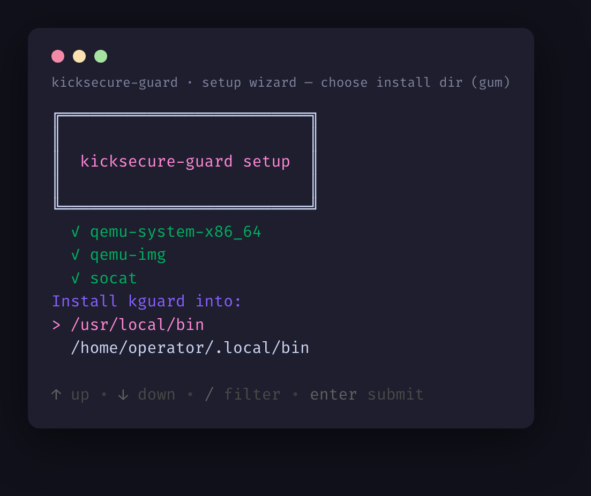
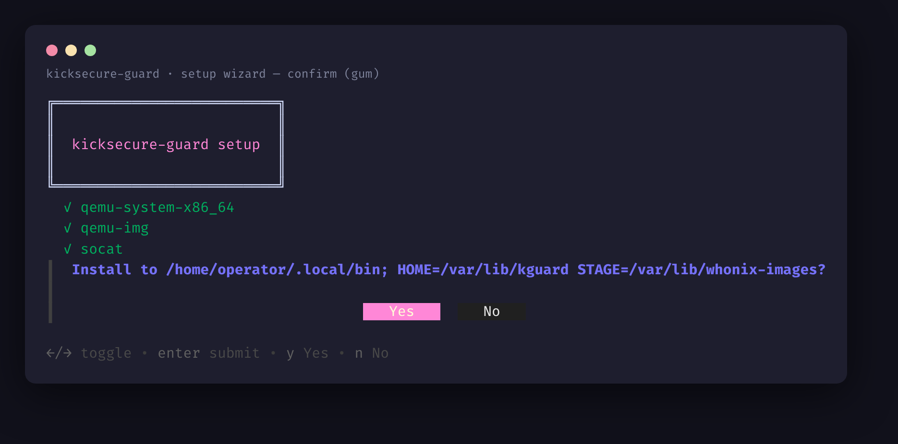
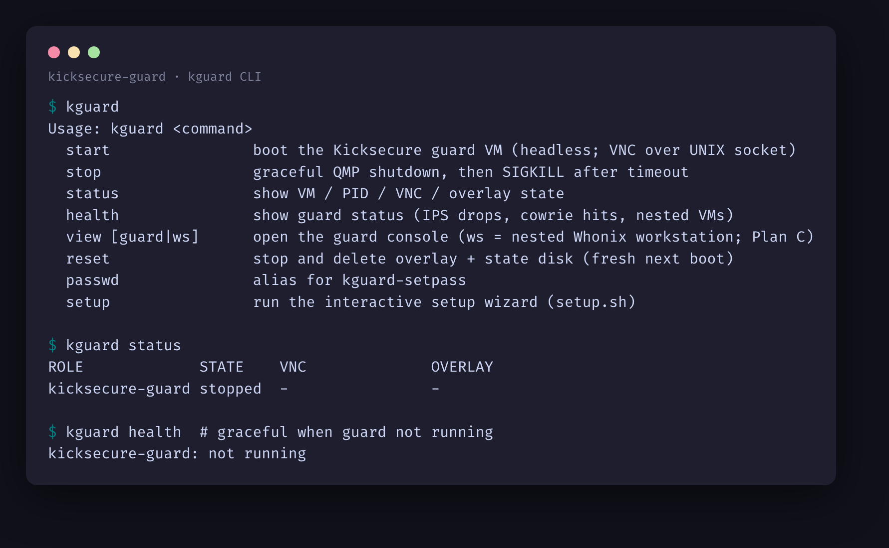
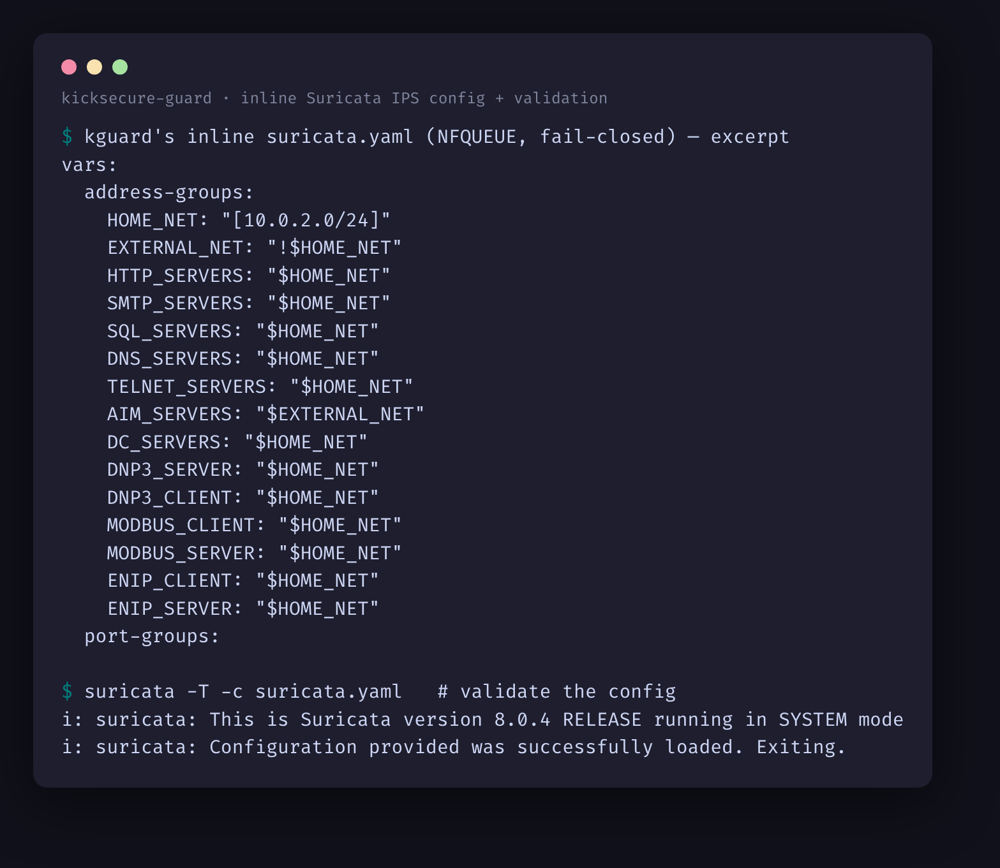
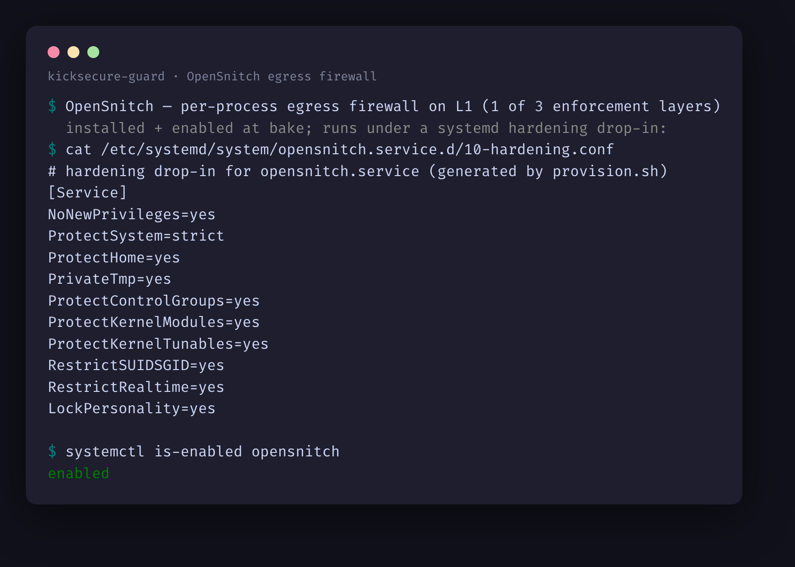
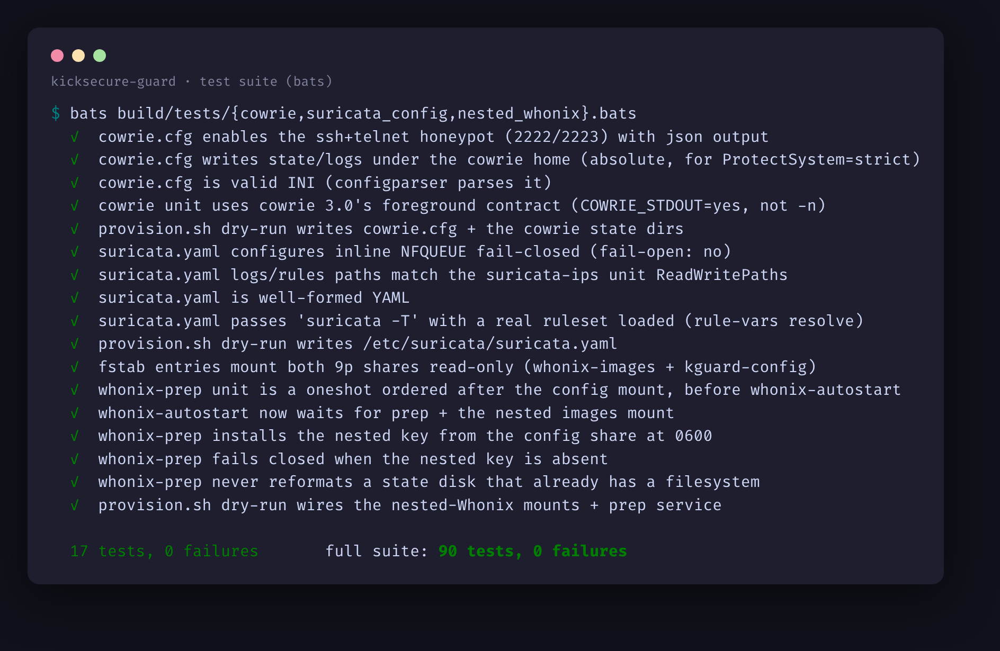
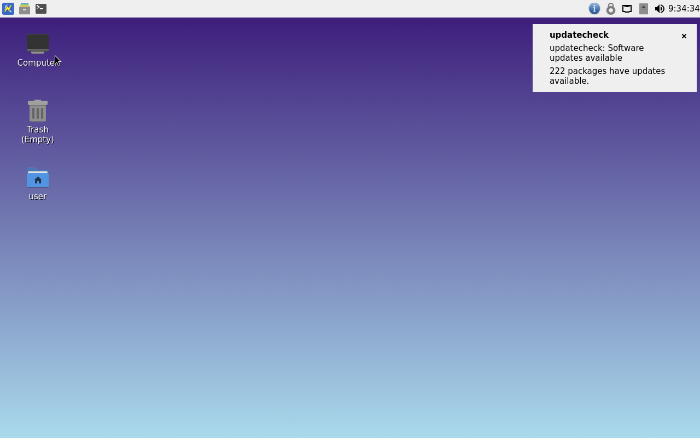
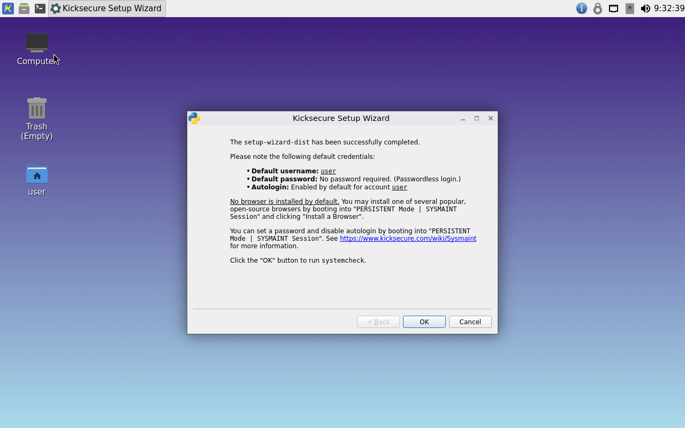

# kicksecure-guard (`kguard`)

A defense-in-depth appliance: Whonix's anonymity run nested inside a hardened Kicksecure
guard VM that wraps it in an inline, fail-closed Suricata IPS plus OpenSnitch and a
Cowrie honeypot. `kguard` is the raw-QEMU/KVM launcher (LUKS-encrypted overlays, UNIX-socket
VNC/QMP under a `0700` dir, nested-KVM, gum setup wizard); `build/` is the image-bake pipeline.

> Sibling to `whonix-runner` (reused heavily). Bring your own Kicksecure + Whonix images.
> Design notes: [`docs/design/`](docs/design/). Build pipeline: [`build/README.md`](build/README.md).

## Status

Built test-first (83 tests, CI, shellcheck) and baked + booted on real hardware.
Honest state of the live appliance:

**Working (verified on a real `BUILD_REAL=1` bake + boot):**
- The pipeline bakes a reproducible Kicksecure guard image (Suricata 8.0.4 from source,
  OpenSnitch, Cowrie, the fail-closed nft leak-guard, the TAP-patched nested launcher) + manifest.
- Boots to Kicksecure; at boot `kguard-net` (bridge/TAP + nft fail-closed leak-guard) and
  `opensnitch` come up active.

**Addressed in the provisioner (2026-06-08; test-verified, pending an operator re-bake to confirm live):**
- nested-Whonix autostart — `kguard start` delivers the guard key into the `kguard-config` 9p share;
  a `kguard-whonix-prep` boot oneshot installs it (0600, fail-closed) and formats/mounts the state
  disk; `/etc/fstab` mounts the 9p shares, ordered before `whonix-autostart`
- `suricata-ips` inline config — provisions a fail-closed NFQUEUE `suricata.yaml` that loads a real
  ET ruleset cleanly under `suricata -T` (Suricata 8.0.4)
- `qemu-guest-agent` enabled at bake (so `kguard health` can read the guest over QGA)
- manifest now pins the actual staged base image by sha256 (`base_image_sha256`), not just the URL
- Cowrie honeypot — pins `cowrie==3.0.0` + a runnable `cowrie.cfg`; verified against a live cowrie
  3.0.0 binding ssh 2222 + telnet 2223 (the old unit's `cowrie start -n` was invalid in 3.0)

**Still in progress** — documented runtime gaps in [`docs/RUNTIME-FINDINGS-2026-06-06.md`](docs/RUNTIME-FINDINGS-2026-06-06.md):
- the `BUILD_REAL=1` re-bake + `KGUARD_INTEGRATION=1` leak-test (operator-only) as the end-to-end proof
- dm-verity real-hashtree wiring (deferred)

This is a proof-of-concept with the runtime integration in progress, not a finished
production anonymity appliance.

## Screenshots

The setup wizard — the real `gum` TUI (falls back to plain prompts when `gum` is absent).
Choosing the install dir ([`screenshots/setup-wizard.png`](screenshots/setup-wizard.png)):

…and the confirmation step ([`screenshots/setup-confirm.png`](screenshots/setup-confirm.png)):

The `kguard` launcher CLI ([`screenshots/cli.png`](screenshots/cli.png)):

The inline Suricata IPS config and its `suricata -T` validation
([`screenshots/suricata-ips.png`](screenshots/suricata-ips.png)):

The fail-closed Suricata IPS unit (`-q 0`, no `--queue-bypass`) + the nftables leak-guard
([`screenshots/suricata-ips-unit.png`](screenshots/suricata-ips-unit.png)):

OpenSnitch — the per-process egress firewall on L1, systemd-hardened and enabled at bake
([`screenshots/opensnitch.png`](screenshots/opensnitch.png)):

The bats test suite ([`screenshots/tests.png`](screenshots/tests.png)):

The hardened base OS — a stock Kicksecure (LXQt) desktop, the foundation the guard VM is built on
(the guard itself runs headless Kicksecure-CLI; the nested workstation runs Whonix)
([`screenshots/kicksecure-desktop.png`](screenshots/kicksecure-desktop.png)):

…and Kicksecure's security-first first-boot setup
([`screenshots/kicksecure-setup-wizard.png`](screenshots/kicksecure-setup-wizard.png)):

Two more are captured on a real `BUILD_REAL=1` bake + boot of the appliance itself:

- the nested Whonix Workstation desktop (L2) — `screenshots/desktop.png` _(pending a live bake)_
- the live inline IPS in the booted guard (`suricata-ips` active + NFQUEUE drop counters) —
  `screenshots/suricata-live.png` _(pending a live bake)_

## Install
    ./setup.sh                      # interactive wizard (gum TUI if present, else plain prompts)
    # or scripted:
    KGUARD_BINDIR=~/.local/bin ./install.sh

## Use
    kguard-setpass                  # set the LUKS passphrase (0600 keyfile)
    kguard start                    # boot the guard VM headless
    kguard view                     # open its console (local X) or print the ssh -L recipe
    kguard status | stop | reset
    kguard health                   # guard status (IPS + units)
    kguard view ws                  # nested Workstation console recipe

## Requirements
- Linux host with nested KVM enabled (`/sys/module/kvm_*/parameters/nested` = Y).
- `qemu-system-x86_64`, `qemu-img`, `socat`; `vncviewer` for local viewing. `gum` is *optional* —
  the setup wizard uses it for a TUI when present and falls back to plain prompts otherwise.
- A baked guard image at `$KGUARD_IMG` (Plan B) — or symlink a stock Kicksecure qcow2 there to test.

## Config
Defaults: `KGUARD_HOME=/var/lib/kguard`, `KGUARD_STAGE=/var/lib/whonix-images`.
Override via env or a host-local config (`$KGUARD_CONFIG`, `/etc/kguard.conf`,
`~/.config/kguard.conf`); see `kguard.conf.example`.

## Tests
    bats tests/*.bats
